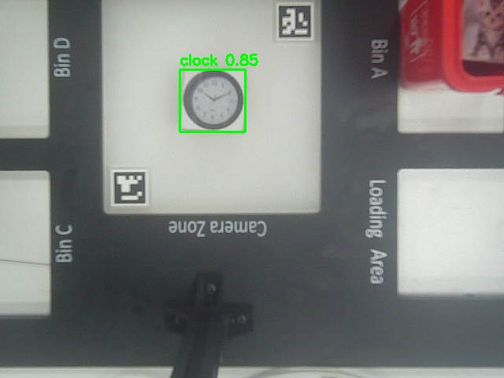
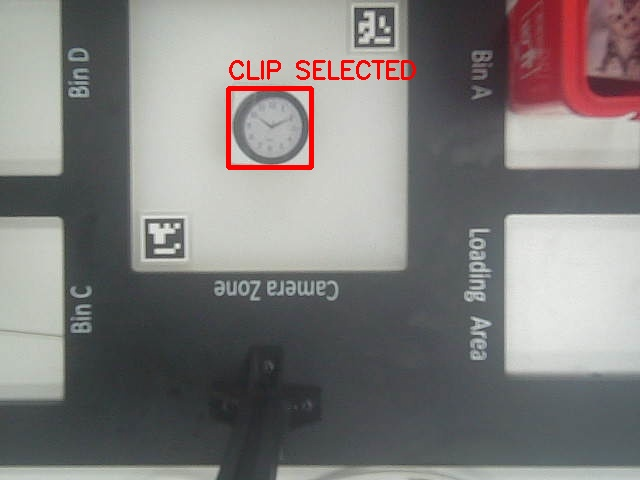

# Real-Time Vision-Guided Robotic Grasping with CNN and Transformer-Based CLIP

## Overview

This project implements a real-time deep learning pipeline that integrates CNN-based object detection, Transformer-based CLIP semantic reasoning, stereo vision, and robotic arm control to perform intelligent object grasping.

The system converts visual detections into calibrated real-world coordinates, enabling accurate spatial inference and autonomous robotic manipulation.

---

## System Architecture

The pipeline consists of four core components:

1. CNN-Based Object Detection  
2. Transformer-Based CLIP Semantic Matching  
3. Stereo Vision & Coordinate Mapping  
4. Robotic Arm Motion Execution  

---

## 1. Object Detection (CNN)

A CNN-based detector generates high-quality candidate bounding boxes from live camera input.

**Pipeline:**  
Image → Letterbox Resize → Model Inference → NMS → Coordinate Restoration

**Key Features:**
- Aspect-ratio preserving resizing for improved recall
- Real-time inference
- Stable bounding box recovery after padding

Output format:
`{bbox(x1, y1, x2, y2), confidence, class}`

---

## 2. Semantic Selection with Transformer-Based CLIP

We integrate CLIP, a Transformer-based vision-language model, to enable flexible natural-language-driven object selection.

CLIP learns a shared embedding space between text and images, allowing zero-shot semantic reasoning.

**Process:**
- Encode standardized prompt templates using CLIP’s Transformer text encoder  
- Encode image crops using the CLIP vision Transformer  
- Normalize embeddings  
- Compute cosine similarity  
- Select the highest-confidence semantic match  

Enhancements include prompt standardization, template averaging, threshold tuning, and rejection of off-screen detections for safety.

---

## 3. Stereo Vision & Spatial Mapping

A binocular stereo camera system supports depth perception and 3D spatial reasoning.

**Coordinate Conversion:**
- Compute object center in pixel space  
- Map pixel coordinates to calibrated real-world space  
- Transform into robotic arm physical coordinates  

This enables accurate target localization for grasp planning.

---

## 4. Robotic Arm Execution

The robotic arm performs a complete automated grasp sequence:

Safe Position → Target Localization → Descent → Vacuum Grasp → Lift → Bin Placement → Release

Calibration includes safe height definition, descent tuning, posture adjustment, and iterative fine-grained offset correction.

---

## Technical Challenges

### Workspace Constraints
Certain edge regions were unreachable in vertical posture due to mechanical limitations.  
Solution: Introduced inclined grasp trajectories to compensate for horizontal workspace limits.

### Coordinate Misalignment
Differences between visual mapping and robotic arm internal coordinates caused grasp offsets.  
Solution: Reset motor zero positions and implemented iterative fine-tuning.

---

## Limitations

- The stereo camera was not fully calibrated using MATLAB-based stereo calibration tools, which may introduce depth estimation inaccuracies.
- Depth estimation relies on practical calibration rather than a fully optimized stereo reconstruction pipeline.
- Performance may degrade under extreme lighting or occlusion conditions.

---

## Technologies

- PyTorch  
- OpenCV  
- CNN-based object detection (YOLO-style)  
- Transformer-based CLIP  
- Stereo vision calibration  
- Robotic arm control APIs  

---

## Outcome

Successfully deployed an end-to-end real-time vision-guided robotic grasping system integrating CNN perception, Transformer-based semantic reasoning, spatial inference, and robotic manipulation.
